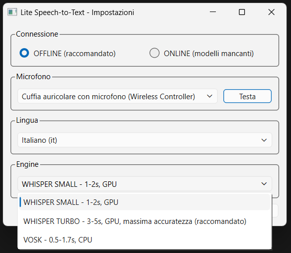

# Lite Speech-to-Text

Trascrizione vocale in tempo reale con supporto multi-engine e multi-lingua.

Applicazione system tray: tieni premuto **CTRL sinistro** per registrare, rilascia per trascrivere. Il testo viene copiato in clipboard e incollato automaticamente.



## Engines

| Engine | Device | Tempo | Note |
|--------|--------|-------|------|
| Whisper Small | GPU CUDA | 1-2s | Buon compromesso velocita'/accuratezza |
| Whisper Turbo | GPU CUDA | 3-5s | Massima accuratezza (large-v3-turbo, raccomandato) |
| Vosk | CPU | 0.5-1.7s | Leggero, completamente offline |

## Lingue supportate

Italiano, English, Espanol, Francais, Deutsch, Portugues.

## Setup

```bash
conda create -n speech-to-text python=3.12 -y
conda activate speech-to-text
pip install -r requirements.txt
```

### Requisiti di sistema

- **Vosk (CPU)**: qualsiasi CPU, ~2GB RAM
- **Whisper (GPU)**: NVIDIA con CUDA, CUDA Toolkit installato

### Modelli

Tutti i modelli vanno nella cartella `models/`:

```
lite-speech-to-text/
  lite_speech_to_text.py
  stt_core.py
  models/
    vosk-model-small-it-0.22/              <-- Vosk (download automatico)
    models--Systran--faster-whisper-small/  <-- Whisper (download automatico)
```

**Download automatico**: selezionare modalita' ONLINE nelle impostazioni al primo avvio. I modelli vengono scaricati automaticamente in `models/` (Whisper e Vosk). Una finestra di progresso mostra l'avanzamento del download.

**Download manuale** (opzionale): scaricare i modelli da [alphacephei.com/vosk/models](https://alphacephei.com/vosk/models) (Vosk) o [HuggingFace](https://huggingface.co/Systran) (Whisper) ed estrarre in `models/`

## Utilizzo

```bash
conda activate speech-to-text
python lite_speech_to_text.py
```

L'applicazione parte nel system tray (icona accanto all'orologio). Al primo avvio si apre la finestra impostazioni per configurare microfono, lingua e engine. Le impostazioni vengono salvate in `config.json`.

### Controlli

- **CTRL sinistro** (tenere premuto): registra
- **CTRL sinistro** (rilasciare): trascrive e incolla
- **Click destro** sull'icona tray: menu (impostazioni, esci)

### Icona tray

- Verde: pronto
- Rosso: registrazione in corso
- Giallo: elaborazione in corso
- Grigio: caricamento modello

## Struttura

| File | Descrizione |
|------|-------------|
| `lite_speech_to_text.py` | UI PyQt6: system tray, impostazioni, entry point |
| `stt_core.py` | Logica core: audio, trascrizione, modelli |
| `config.json` | Impostazioni utente (generato automaticamente) |

## Build eseguibile

```bash
pip install pyinstaller
pyinstaller LiteSpeechToText.spec --noconfirm
```

L'eseguibile viene creato in `dist/LiteSpeechToText/`. I modelli vanno nella cartella `models/` accanto all'exe.

Distribuzione:

```powershell
Compress-Archive -Path "dist\LiteSpeechToText\*" -DestinationPath "LiteSpeechToText-v1.0.0-windows.zip"
```
